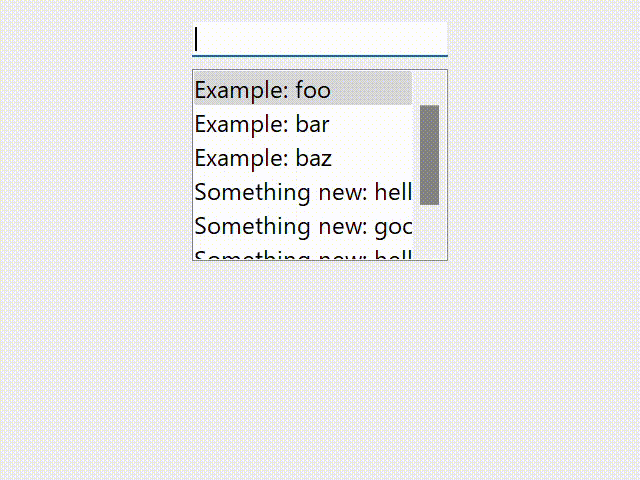

# qt-command-palette

[](https://pypi.org/project/qt-command-palette)
[](https://pypi.org/project/qt-command-palette)

A command palette widget for Qt applications.
This module provides a Pythonic way to register command actions to any Qt widgets.



## Installation

```console
pip install qt-command-palette
```

## Usage

- Register functions using `register` function.

  ```python
  from qt_command_palette import get_palette

  # create command palette instance (with optional app name as an argument)
  palette = get_palette("myapp")

  # prepare a command group
  group = palette("Command group 1")

  # This function will be shown as "Command group 1: run_something"
  @group.register
  def run_something():
      ...

  # This function will be shown as "Command group 1: Run some function"
  @group.register(desc="Run some function")
  def run_something():
      ...

  ```

- Install command palette into Qt widget.

  ```python
  # instantiate your own widget
  qwidget = MyWidget()

  # install command palette, with optional shortcut
  palette.install(qwidget, "Ctrl+Shift+P")

  qwidget.show()
  ```
